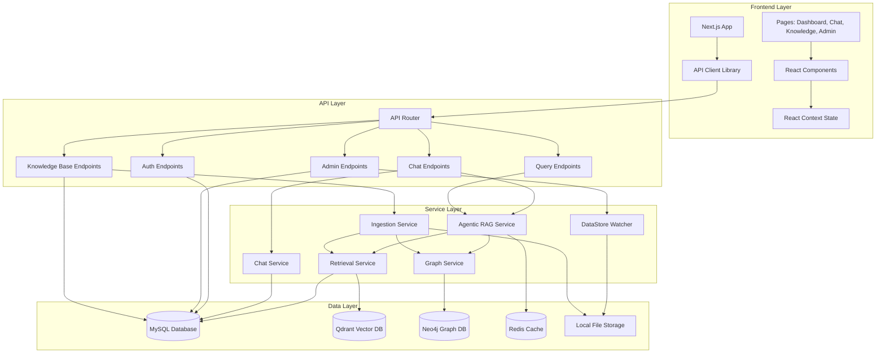
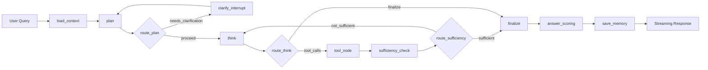
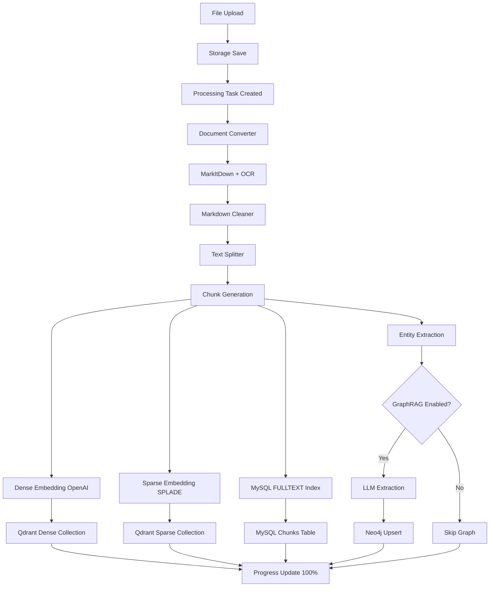
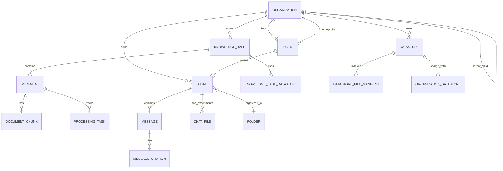

# RAG Web UI - Architecture Diagram

## System Overview

```
┌─────────────────────────────────────────────────────────────────────────────┐
│                              Browser / Client                                │
│                         (Next.js 16 + TypeScript)                           │
└──────────────────────────────┬──────────────────────────────────────────────┘
                               │ HTTPS / SSE
                               ▼
┌─────────────────────────────────────────────────────────────────────────────┐
│                            FastAPI Backend                                   │
│                         (Python 3.11 + LangGraph)                           │
└──────────────────────────────┬──────────────────────────────────────────────┘
                               │
           ┌───────────────────┼───────────────────┐
           │                   │                   │
           ▼                   ▼                   ▼
┌──────────────────┐  ┌──────────────────┐  ┌──────────────────┐
│     MySQL 8.4    │  │     Qdrant       │  │     Neo4j        │
│  (Primary DB)    │  │  (Vector DB)     │  │   (Graph DB)     │
│  - Users         │  │  - Dense Embeds  │  │  - Entities      │
│  - Orgs          │  │  - Sparse Embeds │  │  - Relationships │
│  - Chats         │  │                  │  │                  │
│  - Knowledge     │  │                  │  │                  │
│  - Documents     │  │                  │  │                  │
└──────────────────┘  └──────────────────┘  └──────────────────┘
           │                   │                   │
           └───────────────────┼───────────────────┘
                               │
                               ▼
                    ┌──────────────────┐
                    │     Redis        │
                    │  (Cache + State)  │
                    │  - LangGraph     │
                    │    Checkpoints   │
                    │  - Response Cache│
                    └──────────────────┘
```

## Component Architecture



## Agentic RAG Pipeline Flow



The plan node produces a structured plan with subtasks and pre-populates tool calls for independent subtasks. The think node decides which atomic tool to call next (or emits `final_answer`). The tool node executes it and returns an observation. The sufficiency check uses deterministic shortcuts (3+ searches with few docs, rerank with 10+ docs) plus LLM judgment. The loop continues until the plan is satisfied, the iteration cap is reached, or the wall-clock budget (600s) expires.

**Atomic tool registry:** `search_dense`, `search_sparse`, `search_exact`, `rerank_results` (with provenance validation + auto-fallback), `graph_expand`, `kb_search_documents`, `kb_outline`, `kb_read`, `kb_grep`, `kb_metadata`, `current_datetime`, `file_read`, `file_summarize`, `file_extract_table`, `code_execute`, `chart_generate`, `summarize_answer`, `extract_data`. See `docs/atomic-tools-redesign.md` for the full design.

## Document Ingestion Pipeline



## Multi-Tenant Data Model



## API Endpoint Structure

```
/api
├── /auth
│   ├── POST /register (User registration)
│   ├── POST /token (JWT login)
│   ├── GET /admin-only (Admin test endpoint)
│   ├── POST /change-password (Change password)
│   └── GET /me (Get current user info)
├── /chat
│   ├── GET / (List chats)
│   ├── POST / (Create chat)
│   ├── GET /search (Full-text search across messages)
│   ├── GET /{id} (Get chat with messages)
│   ├── DELETE /{id} (Delete chat)
│   ├── PATCH /{id} (Update chat: title, pinned, KBs)
│   ├── POST /{id}/cancel (Cancel streaming response)
│   ├── POST /{id}/message (Send message with SSE streaming)
│   ├── GET /{id}/messages/paginated (Paginated messages)
│   ├── DELETE /{id}/messages/{msg_id} (Delete message)
│   ├── PATCH /{id}/messages/{msg_id} (Edit message)
│   └── POST /{id}/branch (Create branch from message)
├── /chat/{chat_id}/files
│   ├── POST / (Upload file to chat)
│   ├── GET /{file_id} (Get file status)
│   ├── DELETE /{file_id} (Delete file)
│   └── GET /{file_id}/download (Download file)
├── /folders
│   ├── POST / (Create folder)
│   ├── GET / (List user's folders)
│   ├── PATCH /{folder_id} (Rename folder)
│   ├── DELETE /{folder_id} (Delete folder)
│   ├── PATCH /{folder_id}/chats/{chat_id} (Assign chat to folder)
│   └── DELETE /{folder_id}/chats/{chat_id} (Unassign chat)
├── /knowledge-base
│   ├── POST / (Create KB)
│   ├── GET / (List user's KBs with data sources)
│   ├── GET /{kb_id} (Get KB details)
│   ├── PUT /{kb_id} (Update KB)
│   ├── DELETE /{kb_id} (Delete KB with conditional cascade)
│   ├── POST /{kb_id}/documents/upload (Batch upload documents)
│   ├── POST /{kb_id}/preview (Preview chunking)
│   ├── DELETE /{kb_id}/documents/{doc_id} (Delete document)
│   ├── POST /{kb_id}/data-sources (Link data sources)
│   ├── DELETE /{kb_id}/data-sources/{ds_id} (Unlink data source)
│   └── POST /{kb_id}/test-retrieval (Test retrieval on KB)
├── /query
│   ├── POST / (Stateless RAG query - no chat session)
│   └── GET /kb/{kb_id}/ingest-status (KB processing status)
├── /config
│   └── GET / (Client config: chunk_size, chunk_overlap)
└── /admin (Superadmin only)
    ├── /orgs
    │   ├── GET / (List all orgs - hierarchical)
    │   ├── POST / (Create org - parent_id required)
    │   ├── PATCH /{org_id} (Update org)
    │   ├── DELETE /{org_id} (Delete org)
    │   ├── GET /{org_id}/llm-config (Get org LLM config)
    │   ├── PUT /{org_id}/llm-config (Upsert org LLM config)
    │   └── GET /{org_id}/ingestion-status (Org ingestion status)
    ├── /users
    │   ├── GET / (List all users)
    │   ├── POST / (Create user)
    │   ├── PATCH /{user_id} (Update user)
    │   ├── DELETE /{user_id} (Delete user)
    │   └── POST /{user_id}/change-password (Change user password)
    └── /datastores
        ├── GET / (List all datastores)
        ├── POST / (Create datastore)
        ├── GET /{id} (Get datastore details)
        ├── PATCH /{id} (Update datastore)
        ├── DELETE /{id} (Delete datastore)
        ├── POST /{id}/assign (Assign to orgs)
        ├── DELETE /{id}/assign (Unassign from orgs)
        ├── POST /{id}/scan (Trigger manual scan)
        ├── POST /{id}/stop-scan (Stop scan)
        ├── GET /{id}/scan-progress (Get scan progress)
        ├── GET /{id}/scan-progress-stream (SSE scan progress)
        ├── GET /scan-status (All scan status)
        ├── POST /{id}/flush (Flush pending changes)
        ├── GET /recovery-status (All recovery status)
        ├── GET /{id}/recovery-status (Specific recovery status)
        ├── GET /{id}/recovery-stream (SSE recovery stream)
        └── POST /{id}/recover (Trigger recovery)
```

## Hybrid Retrieval Architecture

```
Query
  │
  ├─→ Dense Vector Search (Qdrant)
  │   └─→ OpenAI text-embedding-3-small
  │   └─→ Cosine similarity
  │   └─→ Top-k results
  │
  ├─→ Sparse Vector Search (Qdrant)
  │   └─→ SPLADE sparse embeddings
  │   └─→ CPU-based FastEmbed
  │   └─→ Top-k results
  │
  ├─→ Exact Keyword Search (MySQL)
  │   └─→ FULLTEXT index
  │   └─→ BM25 ranking
  │   └─→ Top-k results
  │
  └─→ Graph Retrieval (Neo4j)
      └─→ Entity/relationship traversal
      └─→ Multi-hop queries
      └─→ Top-k results

Merge + Recency Dedup + Semantic Dedup
  │
  ├─→ Combine results from all legs
  ├─→ Exact content_hash dedup (keep latest by modified_at)
  ├─→ Semantic dedup (>95% cosine, keep latest by modified_at)
  └─→ Produce unified candidate pool

Cross-Encoder Reranking
  │
  ├─→ ms-marco-MiniLM-L-6-v2
  ├─→ Re-score top N results
  └─→ Final ranked context
```

## Technology Stack Summary

### Backend
- **Framework**: FastAPI with async support
- **Agent Orchestration**: LangGraph (StateGraph with streaming)
- **LLM Framework**: LangChain
- **ORM**: SQLAlchemy with Alembic migrations
- **Vector Database**: Qdrant (dense + sparse embeddings)
- **Graph Database**: Neo4j (GraphRAG)
- **Primary Database**: MySQL 8.4 with FULLTEXT search
- **Cache/State**: Redis Stack (LangGraph checkpoints)
- **Document Processing**: MarkItDown with OCR support
- **Embeddings**: OpenAI (dense), SPLADE/FastEmbed (sparse)
- **Reranking**: ms-marco MiniLM cross-encoder

### Frontend
- **Framework**: Next.js 14 (App Router)
- **Language**: TypeScript
- **Styling**: Tailwind CSS
- **Components**: shadcn/ui (Radix UI primitives)
- **State Management**: React Context
- **Markdown**: react-markdown with syntax highlighting
- **Charts**: echarts
- **Diagrams**: mermaid

### Infrastructure
- **Containerization**: Docker Compose
- **Reverse Proxy**: Custom Next.js server
- **Database Admin**: Adminer
- **File Storage**: Local filesystem with volume mounts
- **Network**: Bridge network with service discovery

## Key Architectural Patterns

1. **Multi-Tenancy**: Hierarchical organization structure with path-based tree traversal
2. **Agentic RAG**: LangGraph-based agent graph with 18 atomic tools, LLM-based sufficiency checking, rerank provenance validation, confidence scoring, and KB exploration (grep/outline/read)
3. **Hybrid Retrieval**: 3-leg search (dense + sparse + exact) with native Qdrant MMR diversity and recency-aware dedup (exact + semantic)
4. **GraphRAG**: Entity/relationship extraction with graph-enhanced retrieval
5. **Streaming**: Server-Sent Events for real-time agent progress updates
6. **Auto-Ingestion**: File system watcher with background processing
7. **Branching**: Conversation branching for exploration of alternate paths
8. **Recovery**: Startup recovery service for crash resilience
